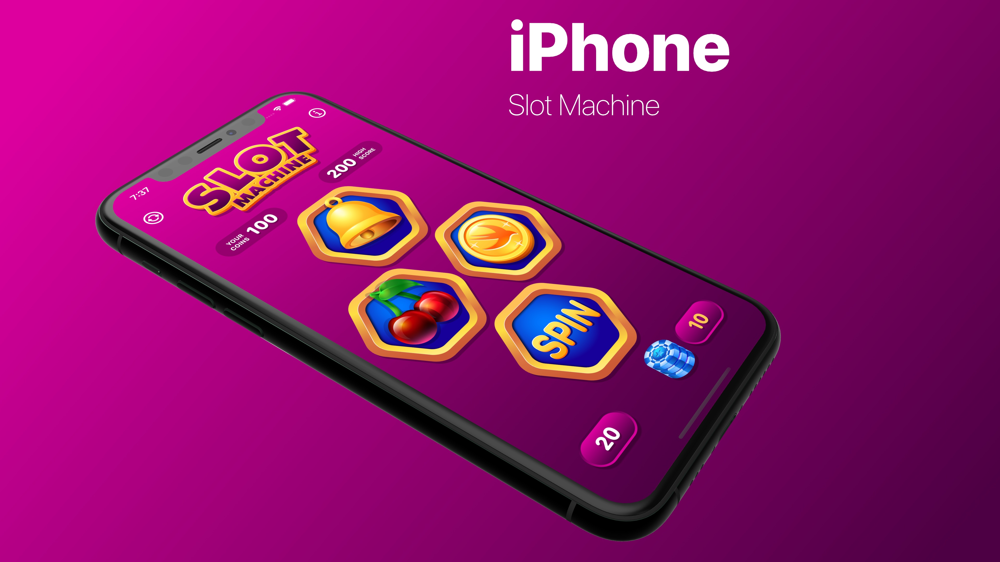

# SwiftUI 2 - Slot Machine
 

  

## Topics are covered:

- [x] How to build an iPhone, an iPad and a Macintosh game  
- [x] How to store data permanently with User’s Defaults
- [x] How to create a complex Game Interface 
- [x] How to code the Game Logic 
- [x] How to use Random Numbers with Swift 
- [x] How to enhance the user experience with sound effects
- [x] How to create extensions and custom View Modifiers
- [x] Build eye-catchy Info view with a logo background music
- [x] How to create a Launch Screen and App Icons

## Meta

Tin Tran – [Linkedin](https://www.linkedin.com/in/realtrantrungtin) – realtrantrungtin@gmail.com
